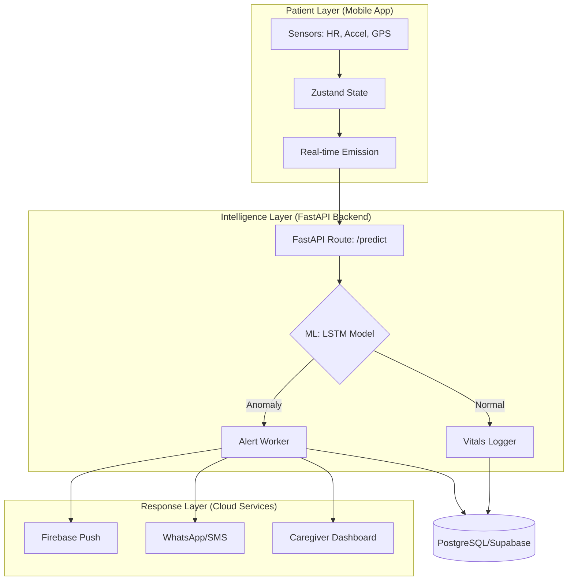

# 🏥 SEHAS: Smart Emergency Health Alert System

## 1. 📋 Executive Summary
The **Smart Emergency Health Alert System (SEHAS)** is a state-of-the-art solution designed to provide real-time health monitoring and emergency response automation. By leveraging **Long Short-Term Memory (LSTM)** neural networks and smartphone-integrated sensors, SEHAS detects critical health anomalies—such as cardiac distress, falls, and voice-triggered emergencies—and orchestrates a seamless alert pipeline to caregivers and emergency services.

## 2. 🏗️ System Architecture
SEHAS follows a robust, event-driven architecture across three primary layers:

## 3. 🛠️ Backend Subsystem
The backend is built with **FastAPI** for high-performance, asynchronous processing.

### 3.1 Tech Stack
- **Framework**: FastAPI (Python 3.11+)
- **ORM/DB**: Psycopg2 with Supabase (PostgreSQL)
- **Authentication**: Bcrypt hashing with JWT (planned)
- **Services**: Async Alert Worker, Notification Engine (Twilio/Firebase)

### 3.2 Key Features
- **Idempotent Alerting**: Prevents duplicate alerts via `X-Idempotency-Key` headers.
- **Safety Window**: Implements a configurable cancellation period (default 10s) to reduce false alarms.
- **Escalation Logic**: Automatically escalates unacknowledged alerts to secondary contacts.
- **Real-time Streaming**: Server-Sent Events (SSE) for live caregiver dashboard updates.

## 4. 🧠 Machine Learning Pipeline
The core intelligence of SEHAS is driven by a temporal anomaly detection model.

### 4.1 Model Architecture (LSTM)
- **Type**: 2-layer LSTM with Dropout for regularization.
- **Input**: Sequence of 20 timesteps (last 20 seconds).
- **Features**: Heart Rate (BPM), Acceleration Mean, Acceleration Std. dev.
- **Output**: Sigmoid probability [0, 1] representing risk level.

### 4.2 Training Strategy
The model is trained on time-series health datasets (e.g., UCI HAR) to learn patterns of "normal" movement vs. "critical" deviations. 
> [!NOTE]
> The model incorporates **Contextual Overrides**: For example, a voice-triggered distress signal or a safe-zone breach will instantly elevate the risk score, regardless of sensor data.

## 5. 📱 Mobile Subsystem (Patient App)
A cross-platform app built using **Expo SDK 54**.

### 5.1 Architecture
- **Navigation**: File-based routing with `expo-router`.
- **Sensors**: Background tracking via `expo-sensors` and `expo-location`.
- **State Management**: `zustand` for high-performance, real-time vital syncing.

### 5.2 Key Screens
- **Dashboard**: Real-time visualization of current heart rate and health status.
- **Heart Rate Monitor**: Dedicated view for detailed cardiac data.
- **Emergency Workflow**: Panic button and automatic countdown to dispatch.

## 6. 🗄️ Database Schema
The system uses a relational PostgreSQL schema designed for time-series logging and alert lifecycle tracking.

- **`patients`**: Core profiles, baseline vitals, and emergency JSONB contacts.
- **`vitals_log`**: High-frequency telemetry storage.
- **`alerts`**: Tracks `pending` -> `dispatched` -> `acknowledged` -> `escalated` transitions.
- **`notification_deliveries`**: Auditable log of all outgoing SMS, WhatsApp, and Push messages.

## 7. 🚀 Deployment & Configuration
### 7.1 Environment Variables
Key configuration required in `.env`:
- `DATABASE_URL`: Connection string for PostgreSQL.
- `SEHAS_API_KEYS`: Comma-separated list for endpoint security.
- `PORT`: Server port (default 8000).

### 7.2 Running Locally
1. **Backend**: `uv run uvicorn api:app --host 0.0.0.0 --port 8000`
2. **Frontend**: `npx expo start` inside `expo-patient-app` directory.

## 8. 🗺️ Future Roadmap
- [ ] **Advanced Fall Detection**: Leveraging 3-axis gyroscope data to confirm postural falls.
- [ ] **Wearable Integration**: Direct Bluetooth sync with Apple Watch and Garmin devices.
- [ ] **AI-Driven Baseline**: Dynamic adjustment of "normal" heart rate per patient over time.
- [ ] **Secure Messaging**: Peer-to-peer encrypted chat between patient and assigned caregiver.
