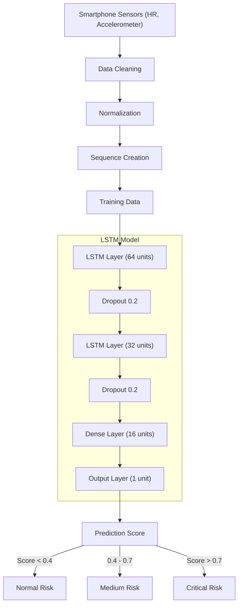

# 📘 AI TRAINING DOCUMENTATION — LSTM MODEL

## 1. 🎯 Objective
The LSTM model is trained to:
- Learn temporal patterns in patient health data
- Detect sequential anomalies (not just single spikes)
- Predict health risk level (Normal / Medium / Critical)

## 2. 🧠 Why LSTM?
LSTM (Long Short-Term Memory) is used because:
- Handles time-series data
- Remembers past patterns
- Detects gradual changes (e.g., slow heart rate drop)

> 👉 **Example:**
> Sudden spike → simple model works
> Gradual deterioration → only LSTM detects

## 3. 📊 Input Features
### 3.1 Features Used
At each time step:
`X_t = [heart_rate, acceleration]`

### 3.2 Sequence Formation
LSTM takes sequences:
`Input Shape = (batch_size, 20 timesteps, 2 features)`

> 👉 **Meaning:**
> Last 20 seconds data
> Each second = 1 row

## 4. 🧹 Data Preprocessing
### 4.1 Cleaning
```python
df = df.dropna()
```

### 4.2 Normalization
```python
from sklearn.preprocessing import MinMaxScaler

scaler = MinMaxScaler()
X = scaler.fit_transform(df[['heart_rate', 'acceleration']])
```

### 4.3 Sequence Creation
```python
import numpy as np

def create_sequences(data, seq_length=20):
    X_seq = []
    for i in range(len(data) - seq_length):
        X_seq.append(data[i:i+seq_length])
    return np.array(X_seq)

X_seq = create_sequences(X)
```

## 5. 🏷️ Labeling Strategy (IMPORTANT)
LSTM needs labels.

**Option A (Hackathon Simple)**
```python
y = np.zeros(len(X_seq))  # assume normal
```

**Option B (Better)**
Define anomalies:
```python
# IF hr < 40 OR hr > 130 → label = 1
# ELSE → label = 0
```

## 6. 🏗️ LSTM Model Architecture

### Architecture & Training Flow Diagram



### Code Implementation
```python
import tensorflow as tf

model = tf.keras.Sequential([
    tf.keras.layers.LSTM(64, return_sequences=True, input_shape=(20,2)),
    tf.keras.layers.Dropout(0.2),
    
    tf.keras.layers.LSTM(32),
    tf.keras.layers.Dropout(0.2),
    
    tf.keras.layers.Dense(16, activation='relu'),
    tf.keras.layers.Dense(1, activation='sigmoid')
])
```

## 7. ⚙️ Model Compilation
```python
model.compile(
    optimizer='adam',
    loss='binary_crossentropy',
    metrics=['accuracy']
)
```

## 8. 🚀 Model Training
```python
history = model.fit(
    X_seq,
    y,
    epochs=10,
    batch_size=32,
    validation_split=0.2
)
```

## 9. 📈 Output Interpretation
Model outputs:
* Prediction ∈ [0, 1]

| Range | Status |
| :--- | :--- |
| **0 – 0.4** | Normal |
| **0.4 – 0.7** | Medium |
| **> 0.7** | Critical |

## 10. 💾 Save Model
```python
model.save("lstm_model.h5")
```
